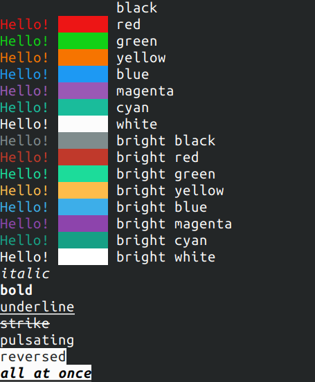

# coformat
A companion C++ library for the std::format to enable text colorization and styling



## API

Simple example:

`cprint("This is {i}italic{ni}, and this is {b}bold{nb}\n");`

All markup control symbols are in the same `{}` brackets as format arguments.
Syntax for text styles are:

```
{i}Italic{ni}
{b}Bold{nb}
{u}Underlined{nu}
{s}Striken{ns}
{p}Pulsating (blinking){np}
{r}Reversed colors{nr}

{d} returns all styles to default
```

Foreground colors are coded as `{fC}` and backround ones as `{bC}`,
where `C` is one of the color codes:

```
bk - black
r  - red
g  - green
b  - blue
y  - yellow
m  - magenta
c  - cyan
w  - white
d  - default color
```

Adding `b` before color codes makes them brighter. For example bright green foreground `{fbg}`

Implemented functions are:

```C++
std::string cvformat( std::string_view fmt, std::format_args args );
std::string cvformat( const std::locale& loc, std::string_view fmt, std::format_args args );

template< class... Args >
std::string cformat( std::string_view fmt, Args&&... args );

template< class... Args >
std::string cformat( const std::locale& loc, std::string_view fmt, Args&&... args );

template< class... Args >
void cprint( std::FILE* stream, std::string_view fmt, Args&&... args );

template< class... Args >
void cprint(std::string_view fmt, Args&&... args );

template< class... Args >
void cprintln( std::FILE* stream, std::string_view fmt, Args&&... args );

template< class... Args >
void cprintln( std::string_view fmt, Args&&... args );

```

They have the same interface as ones from std::format, but the prefix `c` in name. 

Also there are bonus functions, useful for making progress indicators to console

```C++
/// clears the line above and sets the cursor to the begining of it.
/// does not take effect until '\n' is printed somehow
/// does nothing if is_colorized() returns false.
void clear_previous_line();
```

Or control colorization

```C++
/// wheither to colorize.
/// by default output is only colorized if both stderr and stout are outputing into terminal.
/// when any of them is redirected to a file, colorization is disabled.
void colorize(bool v);
bool is_colorized();
```

See the `main.c++` for an example of usage

## Getting it

The library is just 2 files, so just copy the `coformat.h/c++` over to your project. Or use it as CMake dependency. 
